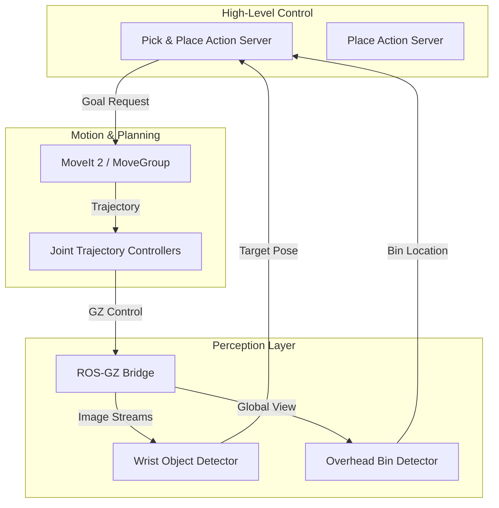

# VS_manipulator: High-Precision Visual Servoing & Autonomous Pick-and-Place

[](https://docs.ros.org/en/humble/index.html)
[](https://gazebosim.org/home)
[](https://opensource.org/licenses/MIT)

A state-of-the-art ROS 2 Humble implementation for autonomous robotic manipulation. This project leverages the **Franka Panda (FER)** manipulator and **Gazebo Fortress** to execute complex pick-and-place tasks driven by a multi-camera visual servoing pipeline.

---

## 🌟 Key Features

- **Modular Action-Based Architecture**: Decoupled task logic using ROS 2 Actions for robust execution and feedback.
- **Dual-Camera Perception**: 
  - **Wrist-mounted Realsense**: For high-precision local visual servoing and grasp alignment.
  - **Overhead Camera**: For global workspace monitoring and dynamic bin localization.
- **Hardened Motion Planning**: Fully integrated with **MoveIt 2**, utilizing OMPL and KDL for collision-free trajectory generation.
- **Visual Servoing 'Lite'**: A hybrid approach combining global planning with local vision-based pose refinement to eliminate simulation jitter.
- **Multi-Robot Ready**: Includes configuration for collaborative environments with **Husarion ROSbot XL**.
- **Physics-Optimized Grasping**: Uses the `DetachableJoint` plugin to ensure stable object transport in Gazebo.

---

## 🏗️ System Architecture

The system is built on a modular ROS 2 architecture, where the high-level task management is handled by Action Servers, and low-level control is managed by MoveIt 2 and hardware-specific controllers.



---

## 📂 Workspace Structure

| Package | Description |
| :--- | :--- |
| `franka_sim_setup` | **Core package**: Launch files, Gazebo worlds, and task logic scripts. |
| `franka_sim_interfaces` | Custom ROS 2 Action and Service definitions. |
| `franka_description` | URDF/XACRO models for the Franka Panda (FER) robot. |
| `franka_ros2` | Standard ROS 2 controllers and driver interfaces. |
| `rosbot_xl_ros` | Integration for the Husarion ROSbot XL mobile platform. |
| `ros_components_description` | Reusable sensor and accessory models (RPLidar, etc.). |

---

## 🚀 Getting Started

### Prerequisites

Ensure you have the following installed on Ubuntu 22.04:
- [ROS 2 Humble](https://docs.ros.org/en/humble/Installation.html)
- [Gazebo Fortress](https://gazebosim.org/docs/fortress/install)
- [MoveIt 2](https://moveit.picknik.ai/humble/doc/how_to_guides/how_to_setup_docker_containers_in_ubuntu.html)
- `ros-humble-ros-gz` bridge

### Installation

```bash
# Clone the repository
git clone https://github.com/ParagChourasia/Visual_servoing_pick_and_Place-.git
cd Visual_servoing_pick_and_Place-

# Install dependencies
rosdep update
rosdep install --from-paths src --ignore-src -r -y

# Build the workspace
colcon build --symlink-install
source install/setup.bash
```

---

## 🛠️ Usage

### 1. Launch the Simulation
Start the Gazebo environment, MoveIt 2, and the perception pipeline:
```bash
ros2 launch franka_sim_setup franka_sim.launch.py
```

### 2. Execute the Autonomous Task
You can run the task using the modular action server or the integrated state machine script.

**Using the Action Server:**
```bash
# Start the server
ros2 run franka_sim_setup pick_and_place_server.py

# Send a goal (e.g., pick red cube and place in bin_1)
ros2 action send_goal /pick_and_place_task franka_sim_interfaces/action/PickAndPlaceTask "{color: 'red', destination: 'bin_1'}"
```

**Using the Integrated Script:**
```bash
ros2 run franka_sim_setup pick_and_place.py
```

---

## 🎥 Demonstration


> **Watch the full video on YouTube:** [Visual Servoing Pick and Place Demo](https://youtu.be/A3lDvh33nuA)

---

## 👤 Author

**Parag Chourasia**  
Robotics & Software Engineer  
[GitHub](https://github.com/ParagChourasia) | [LinkedIn](https://www.linkedin.com/in/parag-chourasia/)

---
*Developed for the Google Deepmind Advanced Agentic Coding project.*
