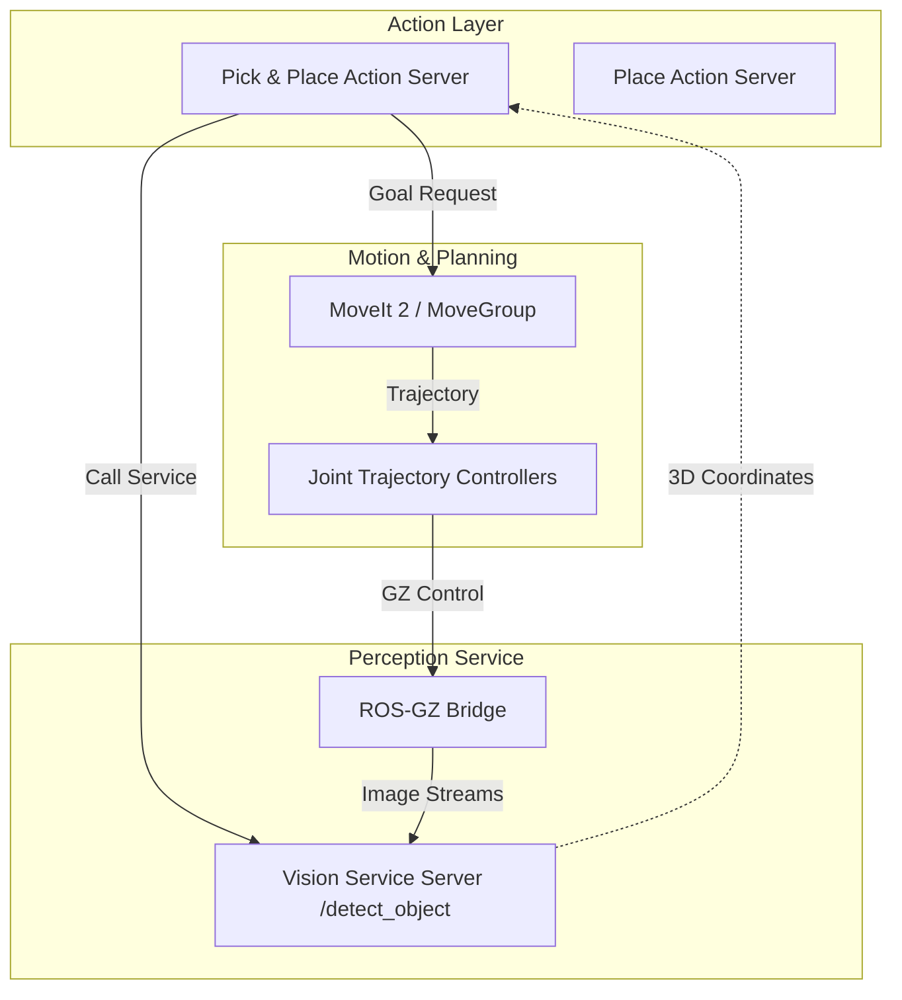

# VS_manipulator: High-Precision Visual Servoing & Autonomous Pick-and-Place

[](https://docs.ros.org/en/humble/index.html)
[](https://gazebosim.org/home)
[](https://opensource.org/licenses/MIT)

A state-of-the-art ROS 2 Humble implementation for autonomous robotic manipulation. This project features a **modular, interface-driven architecture** using ROS 2 Services and Actions to execute complex pick-and-place tasks with the Franka Panda (FER) manipulator.

---

## 🌟 Key Features

- **Modular Interface-Driven Architecture**: Decoupled task logic using **ROS 2 Actions** for lifecycle management and **ROS 2 Services** for on-demand perception.
- **Service-Based Vision**: The vision node acts as a server (`/detect_object`), providing 3D coordinates only when triggered, reducing computational overhead.
- **Action-Based Mission Control**: The entire pick-and-place pipeline is managed via the `/pick_and_place_task` action, offering real-time feedback and robust error handling.
- **Dual-Camera Perception**: 
  - **Wrist-mounted Realsense**: High-precision local visual servoing for grasp alignment.
  - **Overhead Camera**: Global workspace monitoring and dynamic bin localization.
- **Hardened Motion Planning**: Fully integrated with **MoveIt 2**, utilizing OMPL and KDL for collision-free trajectory generation.
- **Physics-Optimized Grasping**: Uses the `DetachableJoint` plugin to ensure stable object transport in Gazebo.

---

## 🏗️ System Architecture



---

## 🚀 Installation & Setup

### Prerequisites
- [ROS 2 Humble](https://docs.ros.org/en/humble/Installation.html)
- [Gazebo Fortress](https://gazebosim.org/docs/fortress/install)
- [MoveIt 2](https://moveit.picknik.ai/humble/doc/how_to_guides/how_to_setup_docker_containers_in_ubuntu.html)

### Build Instructions
```bash
# Clone the repository
git clone https://github.com/ParagChourasia/Visual_servoing_pick_and_Place-.git
cd Visual_servoing_pick_and_Place-

# Build the workspace
colcon build --symlink-install
source install/setup.bash
```

---

## 🛠️ How to Run & Verify

### 1. Launch the Simulation Environment
In the first terminal, start Gazebo and the core robot nodes:
```bash
ros2 launch franka_sim_setup franka_sim.launch.py
```

### 2. Launch the Vision Service
The vision node now acts as a server, waiting for requests to scan for objects:
```bash
ros2 run franka_sim_setup object_detector.py
```

### 3. Launch the Action Server
The Action Server manages the mission lifecycle and coordinates between vision and motion:
```bash
ros2 run franka_sim_setup pick_and_place_server.py
```

### 4. Trigger a Task (via CLI)
You can now trigger the robot using the standard ROS 2 Action CLI. Provide the target color and the destination bin:
```bash
ros2 action send_goal /pick_and_place_task franka_sim_interfaces/action/PickAndPlaceTask "{color: 'red', destination: 'red_bin'}"
```

---

## 🎥 Demonstration

https://github.com/user-attachments/assets/75199672-8874-4860-8f96-df38f8376510

<div align="center">
  <video src="src/images/Vision%20based%20Pick%20an%20placed.mkv" width="100%" controls></video>
</div>


> **Watch the full video on YouTube:** [Visual Servoing Pick and Place Demo](https://youtu.be/A3lDvh33nuA)

---

## 👤 Author

**Parag Chourasia**  
Robotics & Software Engineer  
[GitHub](https://github.com/ParagChourasia) | [LinkedIn](https://www.linkedin.com/in/parag-chourasia/)

---
*Developed for the Google Deepmind Advanced Agentic Coding project.*
